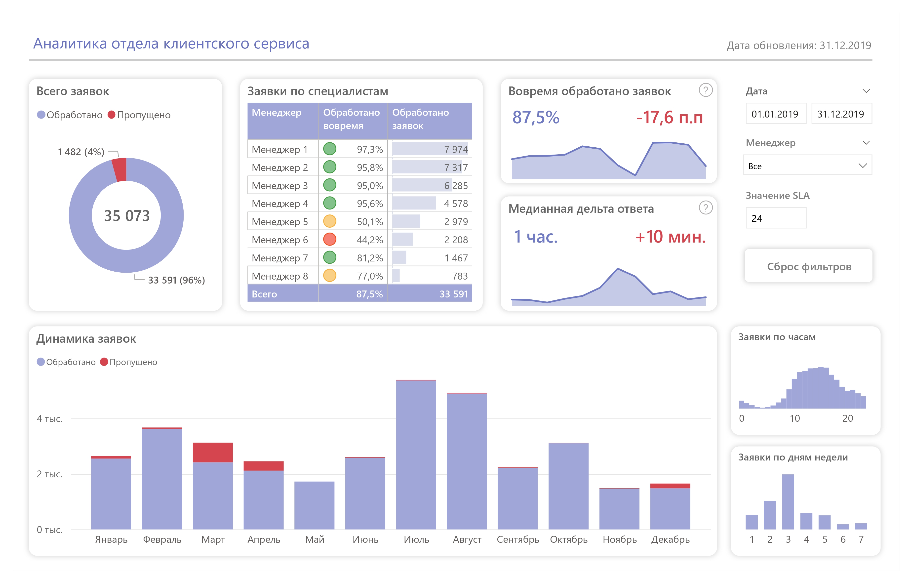

# Дашборд «Аналитика отдела клиентского сервиса за 2019 год»

## Описание
Дашборд «Аналитика отдела клиентского сервиса за 2019 год» отображает ключевые показатели эффективности работы подразделения.
Основные метрики включают количество обращений, медианное время ответа и выполнение SLA.
Панель оснащена интуитивными фильтрами для детализации данных.

## Назначение
Дашборд позволяет:
- **Оценить операционную эффективность**: проанализировать время обработки заявок, уровень обслуживания и загруженность менеджеров.
- **Выявить проблемные зоны**: определить периоды с наибольшим количеством обращений и долгим ожиданием ответа.
- **Оптимизировать ресурсы**: распределить нагрузку между сотрудниками, улучшить процессы обработки обращений и повысить качество обслуживания.

## Реализация
- В документе [development.md](development.md) описана разработка дашборда в **Power BI**.
- В документе [data-mart.md](data-mart.md) разобран процесс создания витрины данных в **PostgreSQL**.
- В документе [client-service.ipynb](client-service.ipynb) начальные этапы создания витрины на **Python** (**SQLAlchemy** и **pandas**).

## Примечание
Данные являются искусственными и созданы для демонстрационных целей.
